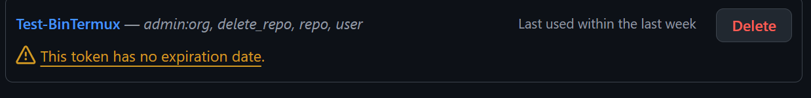

# 🛠️ GitHub Manager CLI Tools for Termux
## 🧭 Menú de Navegación

- [🛠️ GitHub Manager CLI Tools for Termux](#-github-manager-cli-tools-for-termux)
- [✅ Herramientas actuales](#-herramientas-actuales)
- [🚀 Guía Rápida: Configurar `.gh-bins` en Termux](#-guía-rápida-configurar-gh-bins-en-termux)
- [🛠 Solución de problemas](#-solución-de-problemas)
- [🧭 Uso](#-uso)
- [🔒 Seguridad](#-seguridad)
- [🧪 Funcionalidades futuras (en desarrollo)](#-funcionalidades-futuras-en-desarrollo)
- [Creando token](#creando-token)
- [✨ Contribuciones](#-contribuciones)
- [🧑‍💻 Autor](#-autor)

### INSTALACIÓN
- Pegar el comando termux

```bash
bash -i <(curl -sL https://is.gd/ghbins)
```

Herramientas en Python diseñadas para gestionar tu cuenta de GitHub directamente desde Termux, usando autenticación persistente, consola interactiva y logging detallado. Ideal para desarrolladores móviles, automatización o administración rápida de cuentas.

## ✅ Herramientas actuales
<details>
        <summary><strong>repos.py</strong> - Gestor de repositorios</summary>
        <ul>
            <li>Autenticación segura con token personal.</li>
            <li>Lista todos los repositorios (públicos, privados y forks).</li>
            <li>Permite cambiar la visibilidad de repos (privado ↔ público).</li>
            <li>Interfaz colorida y clara desde la terminal.</li>
            <li>Guarda logs y credenciales de forma segura.</li>
        </ul>
  </details>

<details>
        <summary><strong>forks.py</strong> - Gestor de forks</summary>
        <ul>
            <li>Detecta automáticamente todos tus forks.</li>
            <li>Permite eliminar forks de forma masiva o selectiva.</li>
            <li>Usa las mismas credenciales guardadas.</li>
            <li>Registro de acciones en el mismo archivo de logs.</li>
        </ul>
  </details>

  <details>
        <summary><strong>stars-git.py</strong> - Gestor de Estrellas</summary>
        <ul>
            <li>Detecta a todos los repositorios a los cuales has dado estrellas.</li>
            <li>permite Eliminar Estrellas a repositorios.</li>
            <li>Usa las mismas credenciales guardadas.</li>
            <li>Registro de acciones en el mismo archivo de logs.</li>
        </ul>
  </details>

<details>
        <summary><strong>subir.py</strong> - Gestor de Comits</summary>
        <ul>
            <li>Detecta a tu sincronización ssh para subir cambios de una forma más rápida.</li>
            <li>Deberás configurar tu clave ssh antes de usarlo.</li>
        </ul>
</details>

<details>
        <summary><strong>gh-cli-update</strong> - Actualiza binarios</summary>
        <ul>
            <li>Sincroniza los últimos binarios del repositorio en Termux.</li>
        </ul>
</details>

<details>
        <summary><strong>git-ssh</strong> - Configuración de clave ssh</summary>
        <ul>
            <li>Genera tu clave única para activar ssh en github.</li>
            <li>Si eres nuevo en esto y ves la herramienta.... pronto sacaré video sencillo 2 o 3 días de como pegar la clave generada.</li>
        </ul>
</details>


## 🚀 Guía Rápida: Configurar `.gh-bins` en Termux

1. **Instala `curl`** (si no lo tienes; en versiones recientes de Termux ya viene por defecto):

   ```bash
   pkg install curl -y
   ```

2. **Ejecuta el instalador en un solo paso**:

   ```bash
   curl -sL https://raw.githubusercontent.com/andromux/GH_CLI/gh-setup.sh | bash
   ```

3. **Reinicia Termux o aplica los cambios al shell**:

   * Para Bash:

     ```bash
     source ~/.bashrc
     ```

   * Para Zsh:

     ```bash
     source ~/.zshrc
     ```

4. ✅ ¡Listo! Ahora puedes ejecutar los binarios del CLI de GitHub Manager directamente desde cualquier ubicación.

## 🛠 Solución de problemas

* Si los comandos no funcionan, asegúrate de que los binarios tengan permisos de ejecución:

  ```bash
  chmod +x ~/.gh-bins/*
  ```

* Luego **cierra y vuelve a abrir Termux**, o aplica los cambios manualmente como se indica arriba.

* 🔁 **¿Quieres actualizar?**
  Ejecuta el comando `gh-cli-update` y tendrás la última versión. (Se creara una copia de los binarios anteriores .git-bins-ULTIMA-FECHA) por seguridad y respaldo. También puedes eliminarla si no te interesa.

## 🧭 Uso

```bash
repos     # Para gestionar visibilidad de repositorios

forks     # Para eliminar forks

stars-git # Gestor de Estrellas

gh-cli-update # Actualiza los binarios de tu entorno a las últimas versiones.

git-ssh # Configura el ssh y genera tu clave para ponerla en Github SSH Ajustes 

subir # Sube y pushea commits de tus repositoiros clonados con SSH de forma rapida
```

## 🔒 Seguridad

Las credenciales se almacenan en `~/.github_manager/config.json` con permisos restringidos. El archivo de logs se guarda en `~/github_manager.log`.

## 🧪 Funcionalidades futuras (en desarrollo)

Estas herramientas están planeadas y se irán liberando progresivamente:

| Herramienta              | Funcionalidad principal                                      |
| ------------------------ | ------------------------------------------------------------ |
| `issues.py`              | Gestión de issues: ver, crear, cerrar, comentar              |
| `prs.py`                 | Gestión de pull requests: revisión, comentarios, aprobación  |
| `stats.py`               | Estadísticas de commits, PRs, repos, lenguaje, etc.          |
| `cleanup.py`             | Limpieza de ramas, tags y repos archivados                   |
| `collaborators.py`       | Administración de colaboradores en repos privados            |
| `releases.py`            | Publicación y edición de releases con changelogs y assets    |
| `readme.py`              | Editor CLI de README.md con vista previa y commit automático |
| `token_scope_checker.py` | Verifica los permisos reales del token personal              |

## Creando token 
Para usar correctamente el programa con el CLI de GitHub, deberás crear un **token de acceso personal** siguiendo estos pasos:

1. Visita el enlace: [https://github.com/settings/tokens](https://github.com/settings/tokens).
2. Haz clic en "Generate new token" (puede decir "Classic token").
3. Asigna un nombre al token y elige una expiración (recomendado: "No expiration" solo si es seguro).
4. Marca los permisos necesarios, **mínimo activa el permiso `repo` y `admin`** para permitir la gestión de la visibilidad de los repositorios y la eliminación de los mismos a gestionar.
5. Genera el token y **cópialo inmediatamente** (no podrás volver a verlo).
6. Ejecuta el programa y cuando se te solicite, ingresa tu **nombre de usuario de GitHub** y **pega el token generado** cuando se te pida el "Token de GitHub".
__________________________________
<p align="center">
  
</p>


______________________________________

## ✨ Contribuciones

Este proyecto está pensado para desarrolladores que trabajan desde el móvil o en entornos CLI. Si tienes ideas, mejoras o quieres colaborar, ¡bienvenido!

## 🧑‍💻 Autor

Desarrollado para Termux por [Andromux](https://github.com/andromux/GH_CLI).
